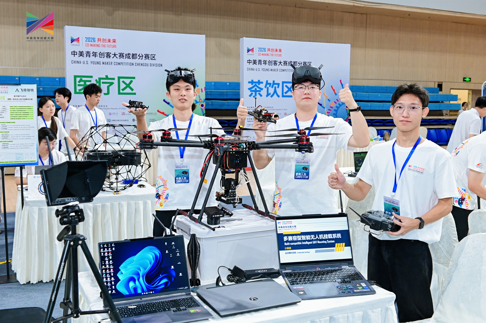
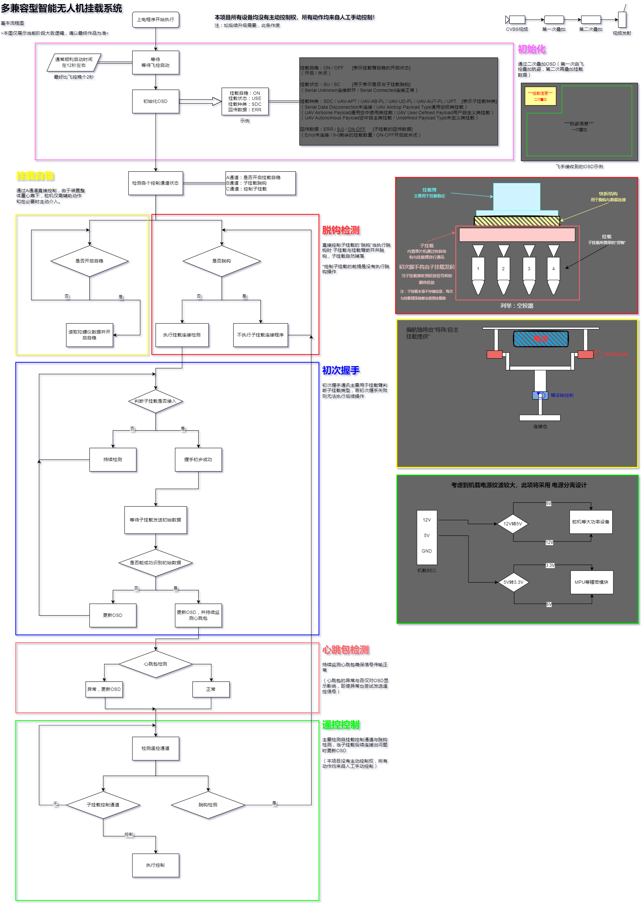
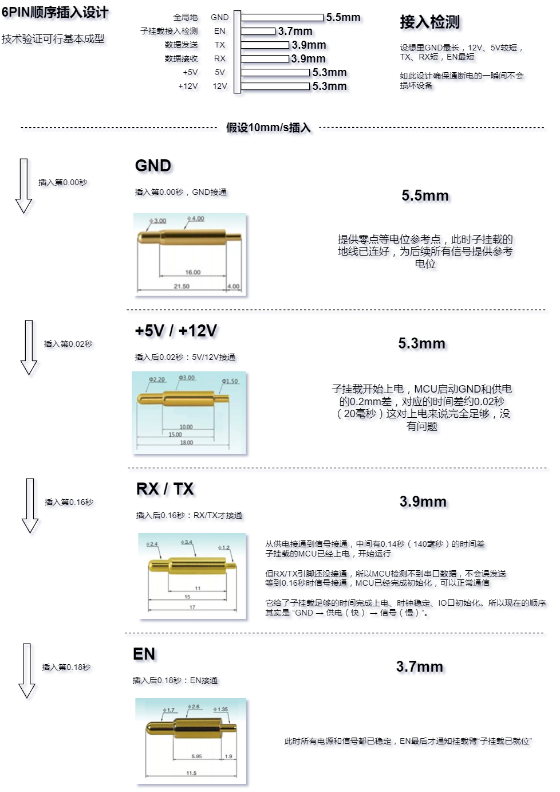
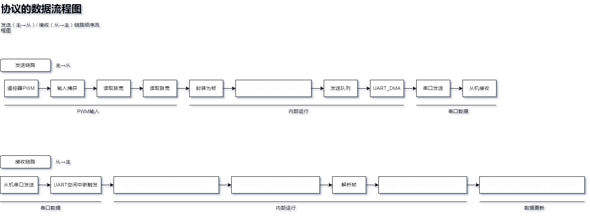

# PnP-Link-UAV-Mount-System
无人机多兼容智能挂载系统，包含机械脱钩结构设计、控制固件与通信协议。本项目为 2026 中美创客大赛参赛作品，按赛事开源评分要求完整公开全部技术方案。

## 项目概述
本项目完整名称为**多兼容型智能无人机挂载系统**完整英文名为“Multi-Compatible Intelligent UAV Payload System”，包含机械脱钩结构设计、3D打印结构件、STM32控制固件与PnP-Link通信协议，可实现不同载荷的快速换装与标准化控制。

## 项目功能
多兼容型智能无人机挂载系统，首创“挂载臂（母座）+子挂载（公头）”分离式架构，彻底打破无人机“一机一用”的局限。
挂载臂固定于无人机底部，集成自稳控制、智能识别与供电管理；子挂载为可更换任务模块，涵盖空投器、喊话器、喷雾器等。两者通过定制6触点热插拔接口连接，采用长短针物理顺序设计，确保插入时地线最先接通、拔出时检测脚最先断开，从硬件层面杜绝热插拔损坏。子挂载插入后自动上报类型码，挂载臂半秒内完成识别与锁定，全程无需工具、无需调参，真正即插即用。
安全方面，系统同时监测EN电气触点、机械微动开关、串口心跳包三重独立信号，经组合逻辑判断约7种故障类型并分级报警。只有三信号同时确认物理脱离，才触发紧急断电，彻底杜绝振动环境下的误脱钩。插销式对称锁定机构带机械自锁斜面，舵机断电后仍保持锁紧。自稳控制采用独有角速度阻尼算法，不依赖飞控、不对抗飞控，有效抑制加减速与气流引起的摆动。
一套挂载臂兼容无限子挂载，让无人机像换相机镜头一样切换任务，真正实现一机多能、降本增效。

## 基本逻辑

## 接口介绍
考虑到无人机热插拔的特殊性，本设计为其提供5V 12V供电以适配绝大部分子设备供电需求，使用顺序接入触点在物理层面杜绝热插拔损坏。

## P&P Link
本协议经过多次优化目前效果较好，其优势有端到端极低延迟：约 5~10ms（主循环 100Hz，串口 115200bps，单帧最小 7 字节 ~0.6ms 传输）、稳定运行频率主循环 100Hz，心跳超时 3000ms，无 ACK 开销，纯单工发送无拥塞控制、协议仅用作挂载控制链路（子设备 PWM 转发 + 心跳），不承担飞控与地面站主链路通信
完整帧结构为：
0xAA | main_id | sub_id | type | data_len | data(0~255B) | checksum | 0x55

本项目为 **2026中美创客大赛** 参赛作品，按赛事「开源共享」评分要求完整公开全部技术方案。

## 发布信息
- **首次公开日期**：2026年7月8日
- **开发主导**：_MXXS_
- **协作开发**：YE

## 关键声明
1. 本项目全部技术方案（含机械结构、控制算法、通信协议）已完整公开。
2. 本项目采用 MIT 许可证开源，任何人可自由学习、使用与修改，详见 LICENSE 文件。
3. 项目附属的P&P-Link(PnP-Link)协议均为原创。
